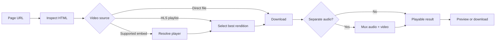

<p align="center">
  
</p>

<p align="center">
  <strong>Paste a public webpage. Get back a playable, downloadable video.</strong>
</p>

<p align="center">
  <a href="https://videoextractor-production.up.railway.app/"><strong>Open the live app</strong></a>
</p>

<p align="center">
  <a href="https://github.com/KelDakroury/videoextractor/actions/workflows/tests.yml"></a>
  
  
  
  
</p>

<p align="center">
  <a href="https://videoextractor-production.up.railway.app/">Live app</a> &middot;
  <a href="#quick-start">Quick start</a> &middot;
  <a href="#how-it-works">How it works</a> &middot;
  <a href="#deployment">Deployment</a> &middot;
  <a href="#security">Security</a>
</p>

---

VideoExtractor is a small, self-contained media extraction service. A user
submits the URL of a public page, the server discovers its video streams,
downloads the best available rendition, combines separate audio and video
tracks when needed, and returns a browser-ready file.

The web application uses temporary local files and in-memory job state. It does
not require a database, user accounts, or permanent media storage.

> [!IMPORTANT]
> Only download media you own or have permission to use. VideoExtractor does
> not bypass DRM, authentication, paywalls, or encrypted streams.

## Highlights

| | Capability |
| --- | --- |
| **Simple workflow** | Paste a URL, follow live progress, preview the result, and download it |
| **Video discovery** | Finds direct video sources, HLS playlists, Vimeo players, and supported nested embeds |
| **Automatic muxing** | Combines separate HLS video and audio tracks into one MP4 |
| **Seekable playback** | Serves byte ranges so browser video controls and seeking work correctly |
| **Temporary by design** | Jobs expire automatically and container restarts discard all generated files |
| **Public URL protection** | Rejects localhost, private networks, credentials, unsafe ports, and private redirects |
| **Dependency-light** | The web server uses the Python standard library; Docker supplies `ffmpeg` |
| **Deployable anywhere** | Includes a production-friendly Docker image and health endpoint |

## Quick Start

### Run locally

Requirements:

- Python 3.9 or newer
- `ffmpeg`, or the Swift toolchain on macOS

```bash
git clone git@github.com:KelDakroury/videoextractor.git
cd videoextractor
python3 webapp.py
```

Open [http://127.0.0.1:8000](http://127.0.0.1:8000), paste a public page URL,
and select **Find the video**.

The web application itself has no required Python packages. Install the legacy
scraper dependencies only when browser automation or the older social-media
commands are needed:

```bash
python3 -m pip install -r requirements.txt
```

### Run with Docker

The image installs `ffmpeg`, runs as a non-root user, and listens on port 8000.

```bash
docker build -t videoextractor .
docker run --rm -p 8000:8000 videoextractor
```

## How It Works



1. `POST /api/jobs` validates the submitted public URL and queues a background
   extraction job.
2. The scraper reads the page and resolves direct media, HLS, Vimeo, and
   supported embedded players.
3. Media tracks are written to an isolated temporary job directory.
4. `ffmpeg` on Linux or Swift/AVFoundation on macOS combines separate tracks
   without transcoding.
5. The browser polls job status and receives seekable preview and download URLs.

## Supported Media

| Source | Status |
| --- | --- |
| Direct HTML video files such as MP4, WebM, and MOV | Supported |
| HLS `.m3u8` playlists | Supported |
| Separate HLS video and audio renditions | Supported and automatically combined |
| Vimeo player embeds | Supported |
| Your Practice Online pages backed by Vimeo | Supported |
| Multiple discoverable videos on one page | Supported, up to the configured safety limit |
| DRM or encrypted HLS | Not supported |
| Login-only, subscription-only, or paywalled media | Not supported |
| YouTube and providers requiring proprietary extraction logic | Not currently supported |

Provider implementations change over time. A page that works today can require
an updated resolver later.

## Configuration

| Environment variable | Default | Description |
| --- | ---: | --- |
| `MEDIA_SCRAPER_HOST` | `127.0.0.1` | Address the server binds to |
| `PORT` | `8000` | HTTP port |
| `MEDIA_SCRAPER_WORKERS` | `2` | Concurrent extraction workers |
| `MEDIA_SCRAPER_MAX_JOBS` | `10` | Maximum queued and active jobs |
| `MEDIA_SCRAPER_MAX_MB` | `500` | Maximum downloaded media per job |
| `MEDIA_SCRAPER_JOB_TTL` | `3600` | Result lifetime in seconds |
| `MEDIA_SCRAPER_JOB_ROOT` | `download/web` | Temporary job directory |

The Docker image overrides `MEDIA_SCRAPER_JOB_ROOT` with the writable,
ephemeral path `/tmp/videoextractor`.

Example for a small public deployment:

```bash
MEDIA_SCRAPER_WORKERS=1 \
MEDIA_SCRAPER_MAX_JOBS=4 \
MEDIA_SCRAPER_MAX_MB=300 \
MEDIA_SCRAPER_JOB_TTL=1800 \
python3 webapp.py
```

## HTTP API

| Method | Endpoint | Purpose |
| --- | --- | --- |
| `GET` | `/` | Web interface |
| `GET` | `/api/health` | Deployment health check |
| `POST` | `/api/jobs` | Submit a page URL |
| `GET` | `/api/jobs/{job_id}` | Read progress and result metadata |
| `GET` | `/api/jobs/{job_id}/files/{index}` | Stream or preview a result |
| `GET` | `/api/jobs/{job_id}/files/{index}?download=1` | Download a result |

Create a job:

```bash
curl -X POST http://127.0.0.1:8000/api/jobs \
  -H 'Content-Type: application/json' \
  -d '{"url":"https://example.com/page-with-video"}'
```

The API returns `202 Accepted` immediately. Poll the returned job URL until its
status becomes `ready` or `failed`.

## Deployment

VideoExtractor is designed for a small, single-instance container deployment.
Railway, Render, Fly.io, and similar Docker hosts can run the included image.

The public deployment is available at
<https://videoextractor-production.up.railway.app/>.

Recommended deployment settings:

```text
replicas: 1
health check: /api/health
persistent volume: none
database: none
MEDIA_SCRAPER_WORKERS: 1
MEDIA_SCRAPER_MAX_JOBS: 4
MEDIA_SCRAPER_MAX_MB: 300
MEDIA_SCRAPER_JOB_TTL: 1800
```

The Docker image already binds to `0.0.0.0` and reads the platform-provided
`PORT`. Generated videos stay on ephemeral container storage.

Keep one replica because job state and file paths are local to the process.
Running multiple replicas requires a shared queue plus object storage, or
platform-level request affinity. Neither is necessary for an initial
deployment.

## Security

The website-facing extraction path includes:

- HTTP/HTTPS-only URL validation
- DNS resolution checks that reject private, loopback, link-local, and reserved
  addresses
- Redirect validation to reduce SSRF risk
- Standard-port enforcement
- An 8 MB source-page limit
- A 20-track limit per page
- A 3,000-segment HLS limit
- A configurable total media download limit
- Safe generated filenames and isolated job directories
- Content Security Policy and defensive response headers
- Bounded worker and queue counts

For an unrestricted public deployment, also add edge-level per-IP rate
limiting, request logging, and an abuse-reporting process. Application checks
should complement, not replace, infrastructure-level outbound network controls.

## Development

Run the test suite:

```bash
python3 -m unittest discover -s tests -v
```

The tests cover public URL validation, private-network blocking, direct HLS
discovery, API behavior, and HTTP byte-range delivery.

Project layout:

```text
.
|-- web/static/          Browser interface
|-- webapp.py            HTTP server, jobs, API, and file delivery
|-- video_service.py     Video-only extraction workflow
|-- mediascrapers.py     Page parsing and provider resolution
|-- util/network.py      Public URL and redirect validation
|-- util/url.py          Direct and HLS downloads
|-- util/media.py        Cross-platform audio/video muxing
|-- tests/               Regression tests
|-- Dockerfile           Linux deployment image with ffmpeg
`-- mediascraper/        Legacy command-line entry points
```

## Legacy CLI

The original general-purpose downloader remains available:

```bash
python3 -m mediascraper.general 'https://example.com/page'
```

It defaults to plain HTTP mode and saves discovered media under
`download/general`. For JavaScript-rendered pages, install the optional
requirements and select a supported browser:

```bash
MEDIA_SCRAPER_DRIVER=safari python3 -m mediascraper.general 'https://example.com/page'
MEDIA_SCRAPER_DRIVER=chrome python3 -m mediascraper.general 'https://example.com/page'
MEDIA_SCRAPER_DRIVER=firefox python3 -m mediascraper.general 'https://example.com/page'
```

The Instagram, Twitter, and other legacy modules are retained from the upstream
project, but their third-party APIs have changed significantly and they are not
part of the tested VideoExtractor workflow.

## Attribution

VideoExtractor is a substantial modernization of
[Elvis Yu-Jing Lin's original media-scraper](https://github.com/elvisyjlin/media-scraper).
The original copyright and MIT license are preserved.

## License

Distributed under the [MIT License](LICENSE).
